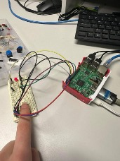
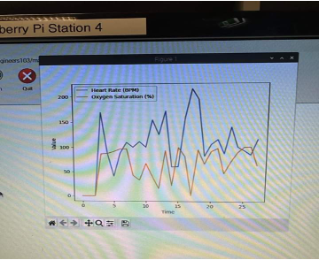
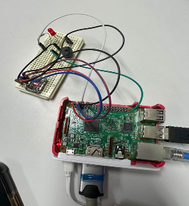

<h1 align="center">IoT Home Healthcare System</h1>
 

  <ul align="left" style="list-style: none;">
    

      <h2>Project description</h2>
    

  </ul>

This project implements an IoT-based home healthcare system using a <b>Raspberry Pi</b>, heart rate and blood oxygen saturation sensors, and various other components to monitor an individual's vital signs. It provides real-time readings and alerts users when heart rate (BPM) or blood oxygen saturation (SpO2) levels go outside of the predefined safe thresholds. Alerts are sent via SMS using Twilio API, and the data is visualised in real-time using Matplotlib.

  <ul align="left" style="list-style: none;">
    

      <h2>Features</h2>
    

  </ul>

<ul>
  <li>Real-time heart rate and SpO2 monitoring.</li>
  <li>Graphical display of measurements.</li>
  <li>LED indicator to confirm sensor finger placement.</li>
  <li>Audible buzzer for out-of-range readings.</li>
  <li>SMS alerts for abnormal heart rate or oxygen saturation levels.</li>
  <li>Data visualisation with Matplotlib.</li>
</ul>

  <ul align="left" style="list-style: none;">
    

      <h2>Technologies Used</h2>
    

  </ul>

 
Twilio API  
Matplotlib 
heartrate_monitor module 
RPi.GPIO module

  <ul align="left" style="list-style: none;">
    

      <h2>Hardware Design</h2>
    

  </ul>

This project utilises a <b>Raspberry Pi 3B</b>, a compact single-board computer, along with various electronic components to create a functional heart rate and blood oxygen monitoring system.
  

<h3>Sensors, Actuators, and Additional Features</h3>
The system integrates the following key components: 
- <b>Heart Rate and Blood Oxygen Sensor:</b> XC3740 heartbeat sensor (MAX30102).   
- <b>LED Indicator:</b> Lights up when a valid reading is detected.   
- <b>Buzzer Alarm:</b> Activates when measurements exceed safe thresholds, assisting hearing-impaired users.   
- <b>Graphical Display:</b> Real-time visualization of heart rate and SpO₂ levels.   
- <b>SMS Alert System:</b> Sends a notification via Twilio when abnormal readings are detected.  
   
<h3>Electrical Schematic Overview </h3> 
The system is designed with careful integration of components:   
- The <b>XC3740 heartbeat sensor</b> connects to the Raspberry Pi for real-time monitoring.     
- A <b>LED indicator (GPIO 14, TXD)</b> with a <b>470-ohm resistor</b> ensures safe voltage regulation.     
- A <b>buzzer (GPIO 18, GPIO 1)</b> provides an auditory alert for abnormal readings.     
- All components share a common ground connection on the <b>Raspberry Pi 3B</b>.    

<h2>How It Works</h2>

1. **Sensor Initialisation**  
   - The Raspberry Pi initialises the heart rate and SpO2 sensor using the 'HeartRateMonitor' module.  
   - The sensor starts detecting the user’s heartbeat and blood oxygen saturation.  

2. **Real-time Data Processing**  
   - The system continuously reads heart rate (BPM) and SpO2 values from the sensor.  
   - Readings are stored in a queue (deque) to maintain a rolling window of the last 100 data points.  

3. **Visual Feedback**  
   - A **LED indicator** (connected to GPIO pin 14) turns on when a valid reading is detected, helping the user position their finger correctly.  
   - A **Matplotlib graph** updates in real-time, displaying heart rate and oxygen saturation trends over time.  

4. **Threshold-based Alerts**  
   - If the **heart rate** falls below 60 BPM or exceeds 100 BPM, the system triggers:  
     - A **buzzer alarm** (GPIO pin 18) to alert the user.  
     - A **Twilio SMS notification** to a predefined phone number, warning of an abnormal heart rate.  
   - If the **SpO2 level** drops below 95%, the system similarly activates the buzzer and sends an SMS alert.  

5. **Continuous Monitoring & Safety Measures**  
   - The program runs in an infinite loop, continuously monitoring vitals and updating the graph every 0.5 seconds.  
   - If the program is interrupted (e.g., user presses `Ctrl + C`), it safely shuts down:  
     - Turns off the LED and buzzer.  
     - Cleans up GPIO resources.  
     - Stops the heart rate sensor.  

<h2>Contributors</h2> 
This project was created by Yuliia Kruta in collaboration with Lucy Kendrick, Patrick Williams, and Max Bailey for the Internet of Things class at UniSC.

<h2>Copyright Notice</h2>

Copyright (c) 2025 Yuliia Kruta, Lucy Kendrick, Patrick Williams, Max Bailey. All rights reserved.

This project is not licensed for reuse, redistribution, or modification without explicit permission from the authors.

